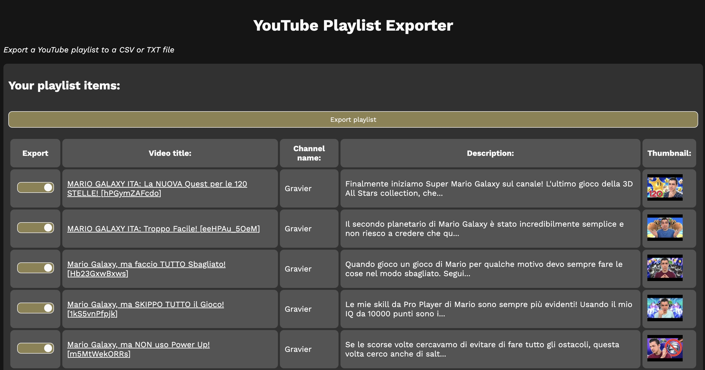

# YouTube Playlist Exporter

Using YouTube's API, export your playlists in a TXT or CSV file.

Try it: https://dinoosauro.github.io/youtube-playlist-exporter

## Usage

You'll need to set up a YouTube API client on the Google Console. Don't worry,
you can find a step-by-step guide
[here](https://dinoosauro.github.io/youtube-playlist-exporter/apiInstructions.html).

After you've obtained a valid Key/Client ID, press "Continue". The key will be
saved in the LocalStorage so that it can be accessed also after refreshing. Now
you need to paste a Playlist URL / Playlist ID. After that, click again on "Get
Playlist Items" button

### Playlist item table

After that, the playlist items will start loading. You can find every item in a
table, and you can also avoid exporting them. Note that you can disable/enable
multiple items by holding Shift.

You can also read the full description by clicking on the text.

### Exportation

You can finally export the playlist, in various formats:

- Export the video URLs (`.txt`)
- Export the video IDs (`.txt`)
- Export the video URLs, the video IDs, the owners and the video title (`.csv`)
- Expocrt all of the video metadata, plus the best thumbnail (`.csv`)
- Export all of the video metadata, and every thumbnail provided by YouTube API
  (`.csv`)

Press on the `Save file` button to download the playlist as a TXT/CSV file.

### Privacy

Everything is done locally, and nothing is sent to an external server. The only
calls done are to Google for fetching the playlist and getting the 'Work Sans'
font.
